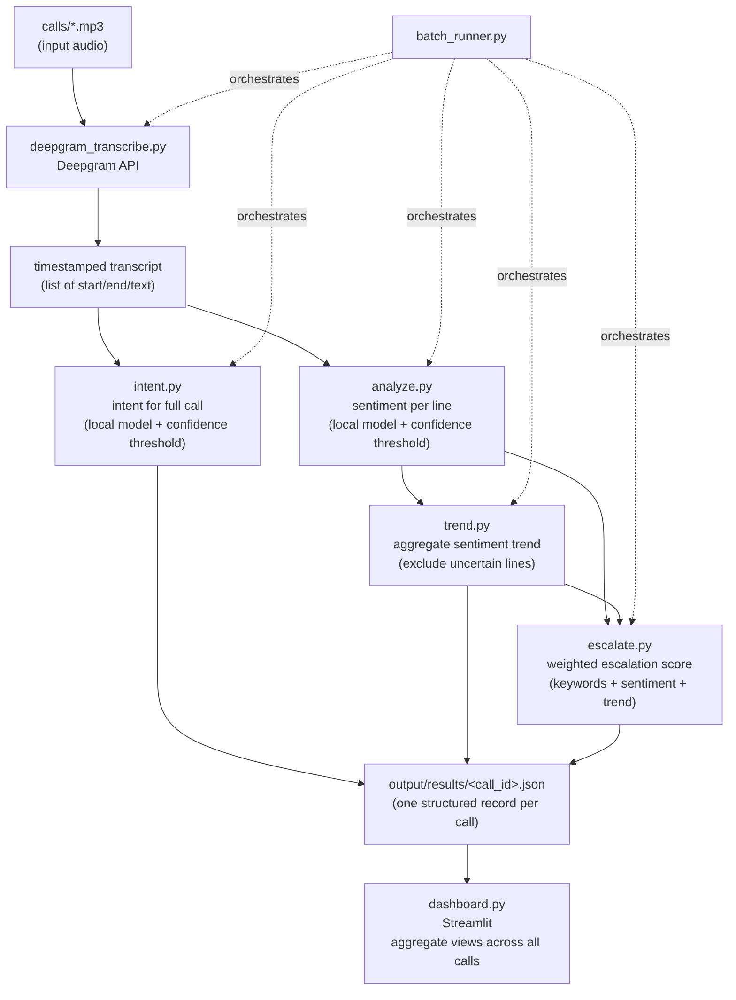

# System Architecture

## Overview

The system is a batch pipeline: it takes pre-recorded customer service call audio and produces structured, per-call analysis (sentiment trend, intent, escalation risk), visualized across all processed calls in a dashboard. There is no live/real-time component — calls are processed one at a time, in a folder, on demand.



## Module responsibilities

| File | Responsibility |
|---|---|
| `deepgram_transcribe.py` | Calls Deepgram API, returns a list of timestamped transcript segments. Also runnable standalone for one file. |
| `analyze.py` | Loads the local multilingual sentiment model; `classify_sentiment(text)` returns raw label, confidence, and a confidence-thresholded `trusted_label`. |
| `trend.py` | Converts trusted sentiment labels to numeric scores, computes the overall average and a first-half-vs-second-half trend direction, excluding uncertain lines from the numeric average. |
| `intent.py` | Loads the local zero-shot classification model; classifies the *full call transcript* (not per-line) into one of a fixed, data-grounded candidate list, with its own confidence threshold. |
| `escalate.py` | Combines keyword matches (tiered strong/weak), sentiment, and trend into one weighted, explainable escalation score (`Low`/`Medium`/`High` + human-readable reasons). |
| `redact.py` | NER-based + keyword-based redaction of organization names from transcripts, for cases where a transcript needs to be shared/reported without exposing client identity. Independent utility, not part of the main scoring pipeline. |
| `batch_runner.py` | Orchestrates the full pipeline (`process_call()`) across every audio file in `calls/`, skips already-processed files, saves one JSON record per call to `output/results/`, and handles per-file failures without stopping the batch. |
| `dashboard.py` | Streamlit app; reads every file in `output/results/`, builds a pandas DataFrame, and renders the call table, KPI metrics, distribution charts, and the escalation hotlist. |
| `validate.py` / `rescore_escalation.py` | Testing utilities: score pipeline output against manually-labeled ground truth; re-run only the escalation-scoring step on already-processed calls without re-calling paid APIs. |

## Per-call output shape

Each `output/results/<call_id>.json` is one structured record:

```json
{
  "lines": [
    {"start": 0.0, "end": 2.0, "text": "...", "sentiment": {"raw_label": "...", "confidence": 0.0, "trusted_label": "..."}}
  ],
  "summary": {
    "total_lines": 0,
    "uncertain_lines": 0,
    "uncertain_ratio": 0.0,
    "overall_average_sentiment": 0.0,
    "trend": "improving | declining | stable",
    "overall_confidence": "high | low",
    "intent": {"raw_intent": "...", "confidence": 0.0, "trusted_intent": "..."},
    "escalation": {"escalation_score": 0, "escalation_level": "Low | Medium | High", "reasons": ["..."]}
  }
}
```

Calls with no detectable speech instead get `{"lines": [], "summary": {"status": "no_speech_detected"}}` — handled as a distinct, expected state rather than an error.

## Key design decisions and rationale

**Local-first, free models by default; paid API only where evidence justified it.** Sentiment and intent both run on free, local, multilingual Hugging Face models — no per-call cost, no API dependency. Transcription is the one exception: `faster-whisper` (free, local) was tried first, produced unreliable/hallucinated output on real accented Hindi-English audio (documented in `PROJECT_LOG.md`), and Deepgram was adopted only after that failure was directly demonstrated — a deliberate, evidence-based tradeoff of cost/dependency for accuracy, not a default assumption that "paid is better."

**Confidence thresholds as a first-class design principle, not an afterthought.** Every model output (`sentiment`, `intent`) is explicitly checked against a threshold and downgraded to `"uncertain"` if below it, rather than trusted blindly. This is applied consistently but with different threshold values, deliberately tuned per task's difficulty (sentiment: 3-class, threshold 0.6; intent: 8-class, harder, threshold 0.4).

**Explainability over raw scores.** The escalation score is never just a number — every contributing factor is logged as a plain-language reason. This was a deliberate choice so the system's decisions can be audited and explained, not treated as a black box, both for the viva and for any real reviewer trusting the tool's output.

**Privacy handled by redaction, not just exclusion.** Raw audio and raw transcripts are never committed to version control. But rather than making all output unusable/unshareable, `redact.py` provides a way to produce a safe-to-share version (organization names removed) — a deliberate two-layer (NER + keyword) approach after discovering the NER model alone had real false negatives.

**Reusable functions over one-off scripts.** Every pipeline stage is a function importable from its module (guarded by `if __name__ == "__main__":`), not just a script that only works standalone. This is what let `run_call_3.py` and later `batch_runner.py` reuse the exact same `classify_sentiment`, `compute_trend`, `classify_intent`, and `assess_escalation` functions without duplicating logic.

**Graceful failure, not crash-on-first-error.** Both `batch_runner.py` (per-file `try`/`except`) and `process_call()` (explicit empty-transcript handling) are designed so one bad input doesn't halt processing of an entire folder of calls — a real requirement once "batch" means more than one file.

## Tech stack

| Layer | Choice | Why |
|---|---|---|
| Language | Python | Required/standard for this kind of ML pipeline work |
| Transcription | Deepgram API (`nova-2`) | Best real-world accuracy on Hindi/English code-switched audio in direct testing |
| Sentiment | `cardiffnlp/twitter-xlm-roberta-base-sentiment-multilingual` (local) | Free, multilingual, gives a real calibrated confidence score |
| Intent | `MoritzLaurer/mDeBERTa-v3-base-mnli-xnli` (local, zero-shot) | Free, multilingual, lets custom categories be defined without training a model |
| Redaction | `dslim/bert-base-NER` (local) + keyword list | Free; keyword list added as a safety net after NER proved incomplete alone |
| Storage | JSON, one file per call | Simple, human-readable, directly matches the project's structured-record requirement |
| Dashboard | Streamlit + pandas | Fast to build, genuinely interactive, standard for this kind of internal analytics tool |
| Environment | `venv` + `requirements.txt` | Reproducible without committing the environment itself |
| Version control | Git + GitHub | Commit history as evidence of iterative, real engineering work |

## Folder structure

```
final_project/
├── calls/                   # input audio (gitignored — private)
├── docs/
│   ├── ARCHITECTURE.md       # this file
│   ├── PROJECT_LOG.md        # phase-by-phase build log, issues, decisions
│   └── intent_taxonomy_reference.md
├── output/                  # all generated data (gitignored — regenerable/private)
│   └── results/              # one JSON per processed call
├── .env                      # API keys (gitignored — never committed)
├── requirements.txt
├── deepgram_transcribe.py
├── analyze.py
├── trend.py
├── intent.py
├── escalate.py
├── redact.py
├── batch_runner.py
├── dashboard.py
├── validate.py
└── rescore_escalation.py
```
